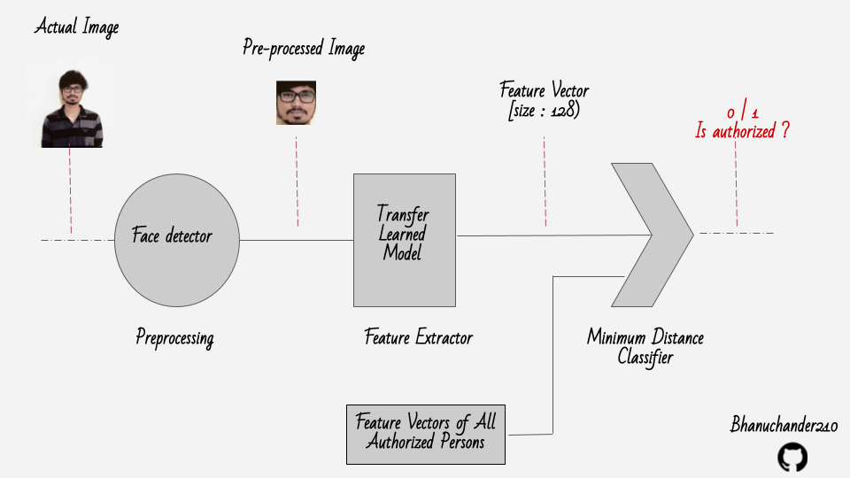

# Face Authentication System
Simple face authentication system


### Work Flow




#### Input Directory Structure

```commandline
input_dir
    |__ person_1
            |__ person_1_face_1.png
            |__ person_1_face_2.png
    |__ person_2
            |__ person_2_face_1.png
            |__ person_2_face_2.png
    |__ ...
```

#### Commands

- Create augmented inputDataSet

```commandline
python face_authentication/augmenter.py --input-dir /path/to/inputDir --output-dir /path/to/augmentedOutDir
```

- Create Pre-Processed images from actual data of both train and test Images

```commandline
python face_authentication/preprocess.py --input-dir trainDataSet --output-dir preProcessTrainDataSet
python face_authentication/preprocess.py --input-dir testDataSet --output-dir preProcessTestDataSet
```

- Creating embeds from the input directory for multiple classes

```commandline
python face_authentication/create_embeds.py --input-dir /path/to/preProcessTrainDataSet --embeds-dir /path/to/embeds/dir
```

#### Data :

- [5 Celebrity faces data set](https://www.kaggle.com/dansbecker/5-celebrity-faces-dataset)

#### Evaluate with models

Available Models :

- [dlib](https://pypi.org/project/dlib/)
- [vgg resnet50](https://github.com/rcmalli/keras-vggface)
- [openface (keras-openface)](https://github.com/iwantooxxoox/Keras-OpenFace)

###### Commands

- Evaluation command 

```commandline
python face_authentication/eval_model.py --test-dir preProcessTestDataSet --embeds-dir embed_dir --model-name dlib
```


- Predict / Authentication check with saved embeds

```commandline
$ python face_authentication/predict.py --test-image /path/to/unauth_image.png --embeds-dir /path/to/embeds/dir --model-name dlib

Unauthorized person.

$ python face_authentication/predict.py --test-image /path/to/new_person_1.png --embeds-dir /path/to/embeds/dir --model-name dlib

Face authorized as : perseon_1

```

- Evaluating model

```commandline
$ python face_authentication/eval_model.py --test-dir /path/to/testDataSet --embeds-dir /path/to/embeds/dir --model-name dlib
```

#### Output :

Note : 

- No false acceptance presented in dlib, vgg.
- Openface (Keras-openface) is not good for one shot learning.


```text
Evaluating the model : dlib
class: ben_afflek, accuracy: 1.000, distances: 0.464-0.471-0.481, total images: 4
class: elton_john, accuracy: 1.000, distances: 0.523-0.551-0.571, total images: 5
class: jerry_seinfeld, accuracy: 1.000, distances: 0.392-0.429-0.494, total images: 5
class: madonna, accuracy: 1.000, distances: 0.502-0.554-0.595, total images: 5
class: mindy_kaling, accuracy: 1.000, distances: 0.384-0.444-0.494, total images: 5
#################################
Model : dlib, average accuracy : 1.0
#################################


Evaluating the model : vgg
class: ben_afflek, accuracy: 0.250, distances: 99.687-99.687-99.687, total images: 4
class: elton_john, accuracy: 0.000, distances: -1.000--1.000--1.000, total images: 5
class: jerry_seinfeld, accuracy: 0.400, distances: 86.629-91.676-96.723, total images: 5
class: madonna, accuracy: 0.000, distances: -1.000--1.000--1.000, total images: 5
class: mindy_kaling, accuracy: 0.400, distances: 93.652-93.750-93.848, total images: 5
#################################
Model : vgg, average accuracy : 0.21000000000000002
#################################

Evaluating the model : openface
class: ben_afflek, accuracy: 0.000, distances: 0.142-0.142-0.142, total images: 4
Warning. False prediction found in class ben_afflek : 0.25
class: elton_john, accuracy: 0.000, distances: -1.000--1.000--1.000, total images: 5
class: jerry_seinfeld, accuracy: 0.200, distances: 0.146-0.146-0.146, total images: 5
class: madonna, accuracy: 0.000, distances: 0.141-0.141-0.141, total images: 5
Warning. False prediction found in class madonna : 0.2
class: mindy_kaling, accuracy: 0.000, distances: -1.000--1.000--1.000, total images: 5
#################################
Model : openface, average accuracy : 0.04
#################################


```